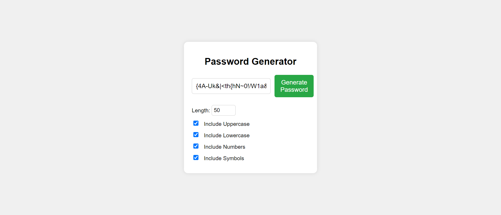

# Random Password Generator

A simple and secure password generator that creates random passwords using a mix of uppercase letters, lowercase letters, numbers, and symbols. Customize your password length and character set to suit your security needs.

## Features

- **Customizable Password Length**: Choose a password length between 4 and 20 characters.
- **Character Options**: Include uppercase letters, lowercase letters, numbers, and symbols in your password.
- **Easy to Use**: Generate passwords with a single click.

## Demo



## How to Use

1. Clone the repository or download the files.

    ```bash
    git clone https://github.com/ivarungupta/random-password-generator.git
    ```

2. Open `index.html` in your web browser.

3. Adjust the password options:
   - Set the desired password length.
   - Toggle the checkboxes to include or exclude uppercase, lowercase, numbers, and symbols.

4. Click the **Generate Password** button.

5. Copy the generated password from the input box.

## Files Included

- `index.html`: The HTML structure of the application.
- `styles.css`: The CSS styling for a clean and user-friendly interface.
- `script.js`: The JavaScript logic for generating random passwords.

## Technologies Used

- **HTML5**: Markup language for structuring the web page.
- **CSS3**: Styling to create a visually appealing interface.
- **JavaScript**: Scripting for password generation functionality.

## Future Enhancements

- **Copy to Clipboard**: Add a button to copy the generated password directly to the clipboard.
- **Password Strength Indicator**: Show the strength of the generated password.
- **Save Generated Passwords**: Option to save passwords locally.

## Contributing

Feel free to fork this repository and submit pull requests. Any improvements or suggestions are welcome!

## Thanks
